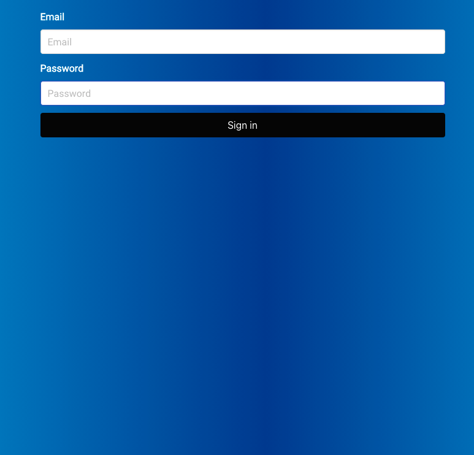
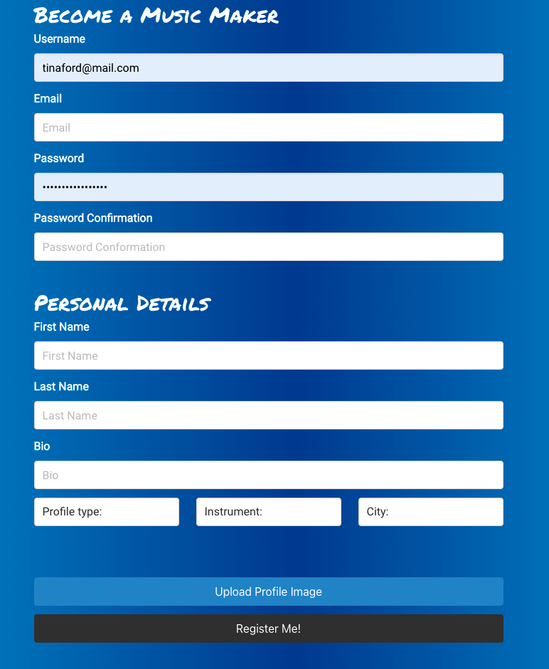
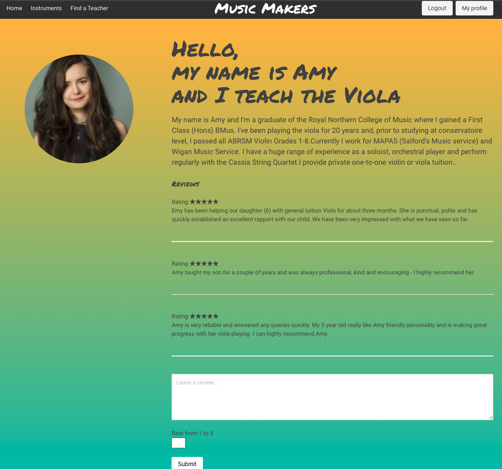

###  General Assembly, Software Engineering Immersive

# Music Makers - A Django & React App


## Overview
This project has been developed during General Assembly course, to design a full-stack Django, PostgresSQL app using over 10 days.

Our app pairs students from leading conservatoires and music degrees with aspiring young musicians from low-income families, offering kids free music tuition.

## Members 

- Drew Lamph - [GitHub](https://github.com/dlamph)

- Dimitar Tsonev - [GitHub](https://github.com/D-Tsonev)

## Deployment

- Please follow the [link](https://music-makers.netlify.app/) to visit the App deployed with Netlify and Heroku and Atlas.

- Feel free to register your account, or you can use a student account - we created for testing purposes.

- Username: `tinaford@mail.com`

- Password: `tinaford@mail.com`

- [Repository link Client](https://github.com/D-Tsonev/project-4-client)

- [Repository link Server](https://github.com/D-Tsonev/project-4-server)

## The Brief 

- To build a full-stack application, making our back end and front end
- Use a Python Django API, using Django REST Framework to serve our data from a PostgresSQL database.
- Consume our API with a separate frontend built with React.
- Build a complete product, which most likely means multiple relationships and CRUD functionality for at least a couple of models.

## Technologies Used
* **Database**:
  * PostgresSQL
* **Backend**:
  * Python
  * Django
* **Frontend**:
  * JavaScript (ES6)
  * React.js
  * HTML5
  * CSS3 + SASS
  * Bulma
* **Dependencies**:
  * Djangorestframework
  * Djangorestframework-camel-case
  * Pyjwt
  * Python-dotenv
  * Psycopg2-binary
  * Axios
  * React-router-dom
  * JSONWebToken
* **Development Tools**:
  * VS Code
  * Git + GitHub
  * TablePlus
  * Excalidraw - White boarding
  * Zoom

## Installation Instructions

1. Clone repo code from GitHub onto your machine.
2. Run `pipenv install` in the root directory to install all packages from Pipfile.
3. Run `pipenv shell` in the root directory to spawn a shell within the virtual environment.
4. Use `python manage.py runserver` to start the backend server in the root driectory.
5. Open a second terminal and `cd client`.
6. Use `yarn` or `npm` in your client directory to install all dependencies from the `package.json` file.
7. Start server: <code>yarn start</code>/<code>npm start</code>.

## General Approach & Planning

Having learnt from a past pair project, we spent a good amount of time planning our application, establishing what relationships would be needed, the user journey and how our ideals for the 'look and feel' of the website. We established our relationships on an ERD Diagram you can see below.


## Whiteboarding 


After only one week of Python and Django tuition under our belt, we decided to set ourselves on a challenging project. We planned for complex functionality, including social aspects of reviews and messaging between users.

# Backend


We started by creating our models for our users, instruments, messages and reviews. Once we had them all completed we could then establish the relationships through foreign keys. Below is an example of our review model.

```js 

class Review(models.Model):
    content = models.TextField(max_length=500)
    created_at = models.DateTimeField(auto_now_add=True)
    rating = models.IntegerField(validators=[MinValueValidator(1), MaxValueValidator(5)])
    user = models.ForeignKey(
    'jwt_auth.User',
    related_name='reviews_received',
    on_delete=models.CASCADE
    )
    owner = models.ForeignKey(
    'jwt_auth.User',
    related_name='reviews_posted',
    on_delete=models.CASCADE
    )

    def __str__(self):
        return f'Comment {self.id} on {self.user}'

```

We then carefully worked through the serializers to ensure they were all correct and populated with the correct relationships before moving onto authentication to restrict certain permissions if you were not a logged-in user. For example, below is a code snippet showing how we were able to show all reviews and how a new review could be created with permission_classes in place.


```js 
class ReviewListView(APIView):

    permission_classes = (IsAuthenticated, )

    def get(self, _request):
        reviews = Review.objects.all()
        serialized_reviews = PopulatedReviewSerializer(reviews, many=True)
        return Response(serialized_reviews.data, status.HTTP_200_OK)

    def post(self, request, user_pk):
        request.data[''] = user_pk
        request.data['owner'] = request.user.id
        serialized_review = ReviewSerializer(data=request.data)
        if serialized_review.is_valid():
            serialized_review.save()
            return Response(serialized_review.data, status=status.HTTP_201_CREATED)
        return Response(serialized_review.errors, status=status.HTTP_422_UNPROCESSABLE_ENTITY)
```

We seeded our data with all instruments and different users creating their profile information on Django admin.


After seeding our data, I then converted it to JSON and re-seeded it into the working backend.
I also checked that the database was set up and seeded correctly with TablePlus.


# Frontend

After 3 days and once all of the backend was tested, with our seeded data in place, we moved onto the React frontend.I took on responsibility for the login and register page, together with the user profile page including displaying reviews which you can see below in the screen shots.






We wanted a slick and clean design that represented a user's profile. To show this I decided to pull the profile picture, instrument type, profile type (student or teacher) and bio of our created users.
The ternary operator was used to check if the registered user is a teacher or student and display a different welcome message for a different type of user.


```js 


  <br/><br/>
  </div>
  <div className="column is-two-thirds">
    <h4> Hello,<br/> my name is {currentUser.firstName}<br/>
      {currentUser.userType === 'Teacher' ?
        ` and I teach the ${currentUser.instrumentType}`
        :
        ` and I am interested in learning the ${currentUser.instrumentType}`
      }
    </h4>
    <br/>
    <p className="is-size-5"> {currentUser.bio} <br /><br /></p>

```

After the user information was presented on the page I began with the review section. Here I wanted any logged in user to be able to leave a review for teacher and reccomendations for the students.

```js
{currentUser.userType === 'Teacher' ?
    'Reviews' : 'Recommendations' }
</h1>
<br />
{ currentUser.userType ?
  currentUser.reviewsReceived.map(review =>(
    <div key={review.id}>
      <ul className="is-size-6">Rating {'★'.repeat(review.rating)} </ul>
      <ul is-size-6>{review.content}  </ul>
      
      {(payload.sub === review.owner) ?
        ( <button className="button is-white" onClick={() => 
        handleDeleteReview(review.id)}>Delete<button>
         :
        <br />
      }

```

A function <code>handleDeleteReview</code> was created to allow only the reviews owner to delete the review.

```js
const handleDeleteReview = async (reviewId) => {
    try {
      await deleteReview(reviewId)
      const { data } = await getUser(id)
      setCurrentUser(data)
    } catch (err) {
      console.log(err)
    }
  }
  ```

# Challenges

This was my first project using a Python Django backend, so I faced a lot of challenges throughout my time working on the backend.

The most challenging element when implementing the backend was understanding the relationships (one to many or many to many) and how to create these relationships within serializers.

For example, we had many relationships to handle at once, especially those related to the user. Below you can see our <code>PopulatedUserSerializer</code>, <code>PopulatedReviewSerializer</code> and <code>PopulatedConversationSerializer</code> which containers different relationships embedded.

```js
class PopulatedUserSerializer(NestedUserSerializer):
    reviews_received = ReviewSerializer(many=True)
    reviews_posted = ReviewSerializer(many=True)
```

```js
class PopulatedReviewSerializer(ReviewSerializer):
    user = NestedUserSerializer(many=True)
    owner = NestedUserSerializer(many=True)
```
```js
class PopulatedConversationSerializer(ConversationSerializer):

    sender = NestedUserSerializer()
    receiver = NestedUserSerializer()
```

The challenging element of this was staying on top of these relationships as we added extra features like a conversation between users. Understanding where they needed to be used as key to the fluidity of the application.


# Key Learning and wins

This project was one of my favourites where I had the opportunity to learn so much.
I loved working with Django and Python. It allowed us to build the backend with a higher speed compared to Node.js.

Building this project has been fun but, the short timeline didn't allow us to implement all the features that we were thinking to add, especially the most useful ones like the conversations between users.

We were both very pleased with how our website looked when it was completed. However, we both felt that there were aspects where we could have done better had we had the chance again.

We worked extremely well together and through thorough planning made a complex project run pretty smoothly on the whole with minimal disruption.

# Future Features

If we had more time to complete this project we would have included:

* Dedicated more time to styling.
* Implemented conversation between user functionality.
* Display the average rating for each user.


